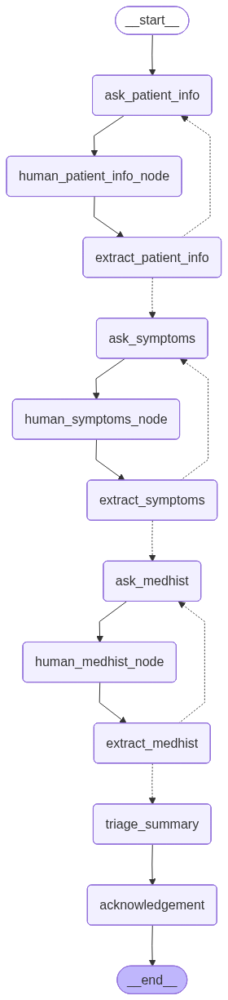

## ClinicAssist — Patient Intake & Triage Flow

ClinicAssist is a patient intake and triage assistant. The backend is built with FastAPI and LangGraph/LangChain to orchestrate a multi‑phase conversation, and the frontend is a minimal Next.js UI for driving the flow.



### What it does
- Collects patient demographics → symptoms → medical/health history → generates a triage summary and acknowledgement
- Uses a graph‑based dialog with explicit phases and loopbacks when information is insufficient
- Persists per‑session conversation state using LangGraph checkpointing

### Architecture
- **Backend (`src/`)**
  - `main.py`: FastAPI app exposing chat endpoints (`/api/chat/start`, `/api/chat/reply`, `/api/chat/end`)
  - `llm_orchestration/clinical_assistant_graph.py`: Builds the LangGraph with nodes and conditional edges across phases
  - `llm_orchestration/part*.py`: Phase nodes for asking/extracting info and routing decisions
  - `models.py`: Pydantic models for agent state and API schemas
  - `prompts.py`: Prompt templates used by nodes
  - `utils.py`: Notebook/utility helpers (graph rendering, time helpers)
- **Frontend (`frontend/`)**
  - Minimal Next.js app with a sidebar and progress bar for the intake steps

### Flow overview (nodes → phases)
- **Phase 1 — Patient Demographics**: `ask_patient_info` → `human_patient_info_node` → `extract_patient_info` → loop or proceed
- **Phase 2 — Symptoms**: `ask_symptoms` → `human_symptoms_node` → `extract_symptoms` → loop or proceed
- **Phase 3 — Medical History**: `ask_medhist` → `human_medhist_node` → `extract_medhist` → loop or proceed
- **Phase 4 — Triage & Summary**: `triage_summary` → `acknowledgement` → end

### Backend: Run locally
Prereqs: Python 3.12+

1) Install deps
```bash
uv sync
```

2) Environment
Create a `.env` file with your LLM provider settings (example uses OpenAI-compatible LangChain `init_chat_model`):
```bash
OPENAI_API_KEY=your_key
LLM_MODEL=gpt-4.1
LLM_TEMPERATURE=0
```

3) Start the API
```bash
uv run uvicorn src.main:app --host 0.0.0.0 --port 8000
```

### Frontend: Run locally
Prereqs: Node 18+

```bash
cd frontend
npm install
npm run dev
```

Open http://localhost:3000

### REST API
- `POST /api/chat/start`
  - Starts a new session and returns the first assistant message
  - Response: `{ session_id, assistant_message, state, phase, is_complete }`

- `POST /api/chat/reply`
  - Body: `{ session_id, message }`
  - Resumes the session with the user’s message and returns the next assistant turn and updated state
  - Response: `{ session_id, assistant_message, state, phase, is_complete }`

- `POST /api/chat/end`
  - Body: `{ session_id, message }` (message ignored)
  - Returns the current state and whether the flow is complete

State is a projection of the agent state limited to user-relevant fields (`patient_name`, `main_symptoms`, etc.).

### Notebooks & visualization
- `src/test.ipynb` contains utilities and examples. Use `utils.show_graph(graph)` to render the LangGraph. For phase‑grouped rendering, you can add `show_graph_grouped(graph, clusters)` as shown in the notebook suggestions.

### Implementation notes
- LLM orchestration is split across small node functions; each node receives and returns partial state updates
- Prompts are explicit about extracting only patient‑stated facts to minimize hallucinations
- Structured outputs (Pydantic) are used where possible for reliability

